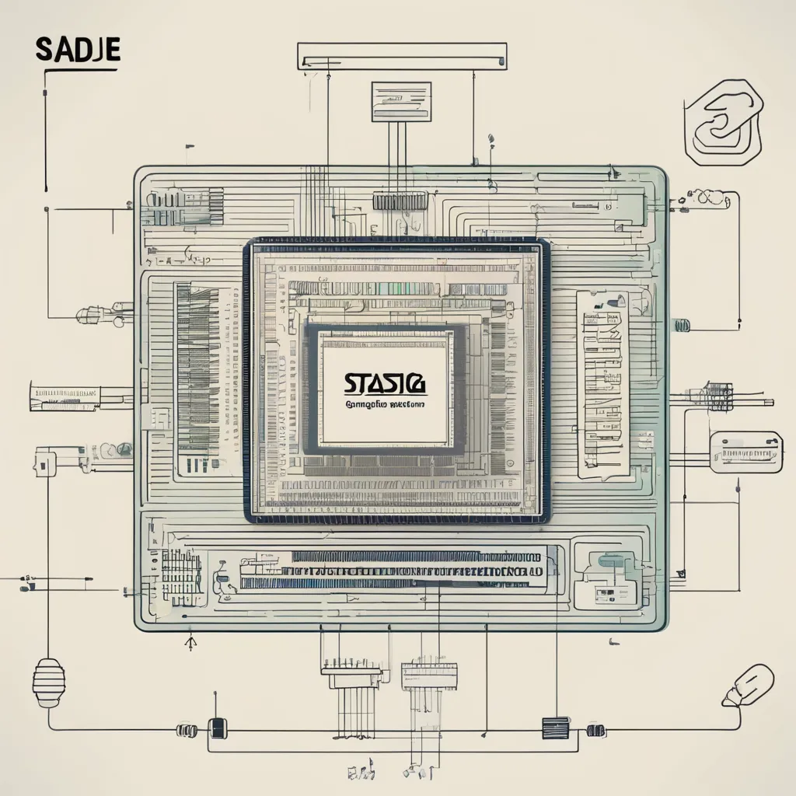

```yaml
layout: default
menuShort: Главная
menuLong: Главная страница
title: Главная страница
```
<!--config-->
## Генератор Статических Сайтов Stasige

Генератор Статических Сайтов на снове древовидной структуры markdown файлов

Пример сайта, созданного с использованием шаблона по умолчанию
- Читайте [о Stasige SSG (en)](/about)
- Читайте [докуменеацию (en)](/docs)

Страница создана для демонстрации многоязычности


